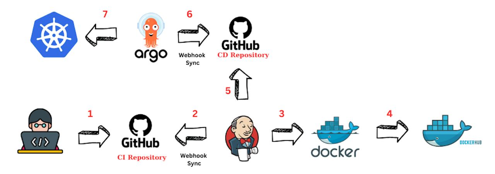

# CI/CD pipeline:
* After developer push code to CI Repository in github.
* Jenkins CI Pipeline will trigger automatically by Webhook ceated in GitHub Repo to run Jenkinsfile in this repo.
* Jenkinsfile clone the repo and build the Docker Image and push it to Docker Hub with tag value of variable {BUILD_NUMBER}.
* Dockerfile makes COPY of Source Code under document root of Nginx.
* CI Pipeline will pass value of variable {BUILD_NUMBER}.
* CD Pipeline will be triggered after CI SUCCESS and run Jenkinsfile in CD repo.
* After Changes the CD repo with New Image in deployment file.
* ArgoCD make SYNC automatically to deploy the new manifest file with new Docker Image created from new Code.
* You can create Argo Application by manifest file (Application.yaml) or Create it manully from Argo Dashboard.
* The Source of application in Argo is CD repository in GitHub and the destination is Kubernetes Cluster.
# Notes:
* If your Jenkins machine doesn't has Public IP and you need make Github Webhook to make Pipeline run automatically If any change occurs . You can use |[Ngrok](https://ngrok.com/download)| to make Public URL for Jenkins or any App.

***

## CI/CD Project image:


***

## Delivery Pizza Website

* Tasty treat website  for delivery foods

***

### URL of Website:
``` sh
* https://659461f4e1f7890404f1d19a--remarkable-speculoos-0bbbf3.netlify.app/home

or On terminal: 

$ google-chrome https://659461f4e1f7890404f1d19a--remarkable-speculoos-0bbbf3.netlify.app/home
```

***

### Used Technologies:
* HTML5
* CSS
* JavaScript

***

## Contributors:
* Developer
|[Ahmed Soliman](https://github.com/solman500)|
* DevOps Engineer
|[Mahmoud Gamal](https://github.com/MahmoudG27)|
